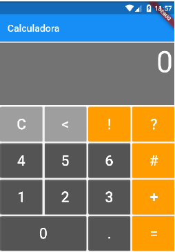
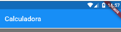

**Universidade Lusófona de Humanidades e Tecnologias**

# Sistemas Móveis Empresariais - Laboratório 2

## Introdução

Neste laboratório iremos desenvolver uma calculadora em Flutter que para além de
cumprir as suas funções básicas, irá possuir um histórico das operações efetuadas. Para isso,
vamos ter que aprender a realizar a navegação de ecrãs no Flutter. Finalmente mas não menos
importante, vamos aprender um padrão arquitetural chamado Business Logic Component
[(BLoC)](https://bloclibrary.dev/#/) que visa realizar a separação de conceitos entre a interface gráfica, as regras de
negócio e o modelo de dados.

## FCalculator

No final da aula, é esperado que consigamos obter uma calculadora igual à que se encontra ilustrada na figura abaixo:

     

## Ecrã Calculadora

Vamos criar um projeto com nome **fcalculator** e seguidamente, vamos apagar tudo o que estiver dentro do ficheiro **main.dart** substituindo-o pelo seguinte:

~~~
import 'package:flutter/material.dart'

void main() => runApp(FCalculator());

class FCalculator extends StatelessWidget {

    @override
    Widget build(BuildContext context) {
        return MAterialApp(
            theme: ThemeData(
                primarySwatch: Colors.blue
            ),
            home: CalculatorScreen(title: 'FCalculator)
        );
    }
}

class CalculatorScreen extends StatelessWidget {
    
    final String title;
    
    CalculatorScreen({required this.title});

    @override
    _CalculatorScreenState createState() => _CalculatorScreenState();
}

class _CalculatorScreenState extens State<CalculatorScreen> {

    @override
    Widget vuild(BuildContext context) {
        return Scaffold(
            appBar: AppBar(title: Text(widget.title))
        )
    }
}
~~~

Agora que já temos o código escrito no nosso ambiente de desenvolvimento, vamos entender o que ele faz:
* No método *main()* estamos a inicializar a nossa aplicação, para isso invocamos o método **runApp** que receberá como argumento o *widget* raíz da nossa
aplicação. Que neste caso, chama-se **fcalculator**;
* Seguidamente, estamos a declarar o *widget* raíz da nossa aplicação que herda os comportamentos de **StatelessWidget**, não tendo assim
qualquer estado;
* Na classe **FCalculator** estamos a fazer *override* do método **build** que irá construir o nosso *widget*. Este método retornará um objeto do tipo **MaterialApp** que nos permitirá utilizarmos a biblioteca do material design da Google. Seguidamente, estamos a passar como argumento um objeto do tipo **ThemeData** onde iremos especificar o estilo de cores que vamos usar no nosso ecrã. Neste caso, estamos apenas a indicar que queremos que a nossa **AppBar** seja pintada com a cor azul. Finalmente, no atributo *home* vamos passar o *widget* **CalculatorScreen** que irá conter tudo o que diz respeito à nossa calculadora, o visor, teclado, entre outros;
* A classe CalculatorScreen que tem um atributo titulo que será escrito na AppBar tal como podemos observar na figura abaixo. O motivo pelo qual este widget terá um estado será revelado mais à frente no laboratório. 

 

*Ao herdarmos os comportamentos de um **StatefulWidget**, temos obrigatoriamente de implementar o método **createState**. Tal como podemos observar, este método apenas retorna um objeto que irá conter o estado do nosso *widget*, que neste caso será um objeto do tipo **_CalculatorScreenState**. As classes que carregam o estado seguem sempre a seguinte nomenclatura: i) Começam com _ (underscore); ii) Assumem o nome do *widget* e finalizam com a palavra **State**;
* A class **_CalculatorScreen** irá conter o estado do *widget* **CalculatorScreen**. Ao contrário dos **StatelessWidgets**, os **StatefulWidgets** tê o método **build** implementafo na classe que possui o seu estado.
* Finalmente, no método **build** atribuimos o título à nossa **AppBar** tal como já foi indicado anteriormente. No entanto, como na classe do estado não temos acesso direto à **String** em questão, temos de ir buscar ao *widget* através da instrução **widget.title**.

Agora que temos a base da nossa calculadora concluída, vamos criar o visor da mesma.

## Visor

O código que irá construir este *widget* da nossa calculadora encontra-se abaixo:

~~~
class Display extends StatelessWidget {

    final content;

    Display({this.content});

    @override
    Widget build(BuildContext context) {
        return Container(
            color: Colors.black54,
            width: MediaQuery.of(context).size.width,
            margin: EdgeInsets.all(2.0),
            child: Column(
                children: <Widget>[
                    Align(
                        alignement: Alignment.centerRight,
                        child: Container(
                            margin: EdgeInsets.all(4.0),
                            height: MediaQuery.of(context).size.height / 5,
                            child: Text(
                                content,
                                style: TextStyle(
                                    fontSize: 60,
                                    color: Colors.white
                                ),
                            ),
                        ),
                    ),
                ],
            ),
        );
    }
}
~~~

Agora que temos o nosso visor concluído, amos adicioná-lo à nossa aplicação. Para isso, temos que alterar o código referente ao estado do *widget* **CalculatorScreen**. Neste caso, a classe passará a assumir a seguinte forma:

~~~
class _CalculatorScreenState extends State<CalculatorScreen> {

    @override
    Widget build(BuildContext context) {
        return Scaffold(
            appBar: AppBar(title: Text(widget.title)),
            body: Column(
                children: <Widget>[
                    Display(content: "0")
                ],
            ),
        );
    }
}
~~~

Tal como podemos verificar, adicionámos ao atributo **body** da classe **Scaffold** uma coluna que irá comportar o nosso visor. Esta coluna recebe um *array* de *widgets* que por agora, irá conter apenas o nosso visor. Finalmente, passamos no construtor do nosso visor a **String** “0” para que o visor seja inicializado com esse mesmo valor.

## Botão 

A nossa calculadora terá dois tipos de botões: os simples e os duplos que são cerca de o dobro dos simples. Tal como ilustrado abaixo, estes botões podem também assumir cores diferentes:

imagemaqui

Tomemos em consideração o pedaço de código abaixo que se refere ao *widget* **Button**:

~~~
class Button extends StatelesWidget {
    
    final double width, height;
    final Function onPressed;
    final String text;
    final color color;

    Button([
        super.key,
        required this.text,
        required this.wifth,
        required this.height,
        this.color = Colors.black54,
        required this.onPressed
    ]);

    @override
    Widget build(BuildContext context) {
        return Container(
            width: width,
            height: height,
            padding: EdgeInsets.all(2.0),
            child: ElevatedButton(
                style: ElevatedButton.styleFrom(primary: this.color),
                onPressed: () => onPressed(text),
                child: Text(
                    this.text,
                    style: TextStyle(fontSize: 30, color: Colors.white)
                ),
            ),
        );
    }
}
~~~

Antes de avançarmos para o método **build**, vamos primeiro perceber a razão de cada um dos atributos deste *widget*:
* Numa das propriedades **Function** que será uma referência para a função que o botão irá invocar quando for pressionado. Ao passarmos uma referência de uma função, no construtor deste *widget*, ficaremos com um botão cujo seu comportamento é genérico tendo assim múltiplas utilidades;
* As propriedades **text** e **color** dizem respeito ao texto a ser apresentado e a cor do mesmo a ser exibida;
* Porém, no construtor do Botão, estamos a definir um valor de omissão da cor como preto;
* Atribuimos também uma margem de duas unidades em torno do texto a ser exibido, ficando assim com as extremidades do botão menos próximas do texto;
* Finalmente, dentro do método **build** e na definição do botão, temos a invocação da função passada em argumento no construtor e guardada no atributo **onPressed** sendo invocada assim que o botão é pressionado.

Agora que temos uma classe genérica que cria botões com o texto, cor, dimensões e comportamento que desejarmos podemos avançar para a criação do nosso próximo *widget*, o teclado.

## Teclado

O teclado não é nada menos do que um *widget* que agrega um conjunto de botões:

~~~
class Keyboard extends StatelessWidget {

    final keys = [
        ["1", "2", "3", "+"],
        ["0", ".", "="]
    ];

    @override
    Widget build(BuildContext context) {
        return Container(
            child: Column(
                children: <Widget>[
                    Row(
                        children: <Widget>[
                            Button(
                                text: "1",
                                width: calculateButtonWidth(context),
                                height: calculateButtonHeight(context),
                                onPressed: (symbol) => print(symbol)
                            ),
                            Button(
                                text: "2",
                                width: calculateButtonWidth(context),
                                height: calculateButtonHeight(context),
                                onPressed: (symbol) => print(symbol)
                            ),
                            Button(
                                text: "3",
                                width: calculateButtonWidth(context),
                                height: calculateButtonHeight(context),
                                onPressed: (symbol) => print(symbol)
                            ),
                            Button(
                                text: "+",
                                width: calculateButtonWidth(context),
                                height: calculateButtonHeight(context),
                                onPressed: (symbol) => print(symbol)
                            ),
                        ]
                    ),
                    Row(
                        mainAxisAlignment: MainAxisAlignment.spaceEvenly,
                        children: <Widget>[
                            Button(
                                text: "0",
                                width: calculateButtonWidth(context, isDouble: true),
                                height: calculateButtonHeight(context),
                                onPressed: (symbol) => print(symbol)
                            ),
                            Button(
                                text: ".",
                                width: calculateButtonWidth(context),
                                height: calculateButtonHeight(context),
                                onPressed: (symbol) => print(symbol)
                            ),
                            Button(
                                text: "=",
                                width: calculateButtonWidth(context),
                                height: calculateButtonHeight(context),
                                onPressed: (symbol) => print(symbol)
                            ),
                        ]
                    )
                ],
            )
        );
    }

    double calculateButtonWidth(context, {isDouble = false}) {
        double width = MediaQuery.of(context).size.width / 4;
        return isDouble ? (width * 2) : width;
    }

    double calculateButtonHeight(context) {
        return MediaQuery.of(context).size.height / 8;
    }
}
~~~

À semelhança do que foi realiado para os restantes *widgets*, vamos perceber detalhadamente as nuances deste *widget*.

* Nas propriedades, temos a declaração de um *array* com o nome **keys** onde está o texto que vai ser escrito em cada um dos botões;
* Seguidamento, se reparamos nos elementos estruturantes **Row** e **Column**, estamos a definir uma tabela "invisivel" com uma coluna e duas linhas. Neste caso corresponde à forma como o teclado é construído, de forma vertical, de cima para baixo. Despois, os botões são colocados linha-a-linha, da esquerda para a direita;
* Na linha de código onde é definido o primeiro botão:
  * O objeto **context** fornece informações de acordo com o equipamento, ou o estado da aplicação. Uma vez que as dimensões diferem de equipamento para equipamento, não as podemos usar de forma estática. Como queremos ocupar todo o espaço horizontal, temos que dividir o espaço total pelo número máximo de botões que queremos comportar, neste caso, serão 4 botões. Finalmento a largura do botão é redimensionada para o dobro (como é o caso do zero) caso o atributo **isDouble** assuma o valor **true**;
  * Este método é relativamente semelhante ao anterior com a diferença que o fator de 8 se deve ao ajuste que teremos de efetuar em consonância com o visor, isto porque, queremos que ambos os *widgets*, (visor e o teclado) ocupem toda a área existente no ecrã.

Agora que já temos o nosso teclado parcialmente desenvolvido, vamos adicioná-lo ao nosso ecrã principal. Para isso adicionamos o *widget* **Keyboard** logo abaixo do **Display** à classe **_CalculatorScreenState**.

~~~
class _CalculatorScreenState extends State<CalculatorSreen> {

    @override
    Widget build(BuildContext context) {
        return Scaffold(
            appBat: AppBar(title: Text(widget.title))
            body: Column(
                children: <Widget>[
                    Display(content: "0"),
                    Keyboard(),
                ],
            ),
        );
    }
}
~~~

Se executarmos uma vez mais a nossa calculadora, iremos ter algo semelhante ao que se encontra ilustrado na figura abaixo.

Para que a calculador fique funcional, só nos falta adicionar os comportamentos dos botões.

## BLoC

O sucesso de um software depende também muito da forma como o mesmo é arquitetado, ainda durante a sua fase de desenvolvimento poderão surgir alterações. Mesmo já na fase de produção, é necessário realizar operações de manutenção e provavelmente a acomodação novamente de outras funcionalidades. Não basta apenas pensarmos que a generalização da classe ou do método é suficiente, a forma como os diversos componentes
comunicam é também importante. Ao nível arquitetural, o modelo de três camadas resolve os problemas:

* A **camada de apresentação** lida apenas com a parte gráfica, isto é, com a apresentação de dados ou informações ao utilizador. É esta a camada que permite com que o utilizador interaja com o nosso *software*;
* A **camada de domínio ou lógica de negócio** lida com os pedidos do utilizador e produz respostas tendo em conta esses pedidos;
* Finalmente, a **camada de acesso a dados** lida somente com a persistência dos dados.

O [BLoC](https://bloclibrary.dev/#/architecture) enquadra-se no rectângulo azul, ou seja, lida com a comunicação entre a camada de apresentação e a persistência dos dados. Vamos criar um ficheiro chamado calculator.dart dentro de uma pasta chamada blocs (dentro da pasta lib). Seguidamente, adicionaremos a este ficheiro o seguinte código:

~~~
import 'dart:async';
import 'package:expressions/expressions.dart';

class Calculator {
    String _content = "0";

    StreamController _controller = StreamController();

    Sink get _input => _controller.sink;

    Stream get _output => _controller.stream;

    void onReceiveSymbol(symbol) {
        _content = _content == null ? symbol : _content += symbol;
        _input.add(_content);
    }

    void onEquals() {
        final expression = Expression.parse(_content);
        _content = ExpressionEvaluator().eval(expression, {}).toString();
        _input.add(_content);
    }

    void dispose() => _controller.close();

}
~~~

Tal como temos vindo a fazer ao longo do laboratório, vamos perceber linha-a-linha o que está a ser feito no código:

* Na propriedade **_controller** estamos a definir um objeto do tipo **StreamController**. Este objeto oferece um canal de comunicação **assíncrono** que tem uma entrada (**sink**) e uma saída (**stream**).
* Outras propriedades estão relacionadas com o **_controller** e definidas como dois *getters*, um que dá acesso ao **sink(input)** e outro que dá acesso à **stream(output)**;
* O método **onReceiveSymbol** recebe símbolos (1, 2, +, *) emitidos pelos botões e guardál-los na **String _content** que irá guardr o conteúdo a ser apresentado no visor da nossa calculadora. Seguidamente, o método **onEquals** tendo por base o conteúdo variável **_content**;
* O método **dispose** que é responsável por encerrar o canal de comunicação através do método **close** do **StreamController**. Este método é invocado automaticamente por qualquer **StatefulWidget** assim que deixa de estar presente no ecrã. Como o nosso visor é um **StatefulWidget**, temos de fazer *override* desse método por forma a invocar o **dispose** do nosso BLoC.

Para realizar os cáculos, vamos utilizar uma biblioteca que não faz parte do Dart, chamada **Expression**. Para isso é necessário adicionarmos uma dependência no ficheiro **pubespec.yaml** e adicionar a biblioteca: **expressions: 0.2.3** tal como exemplificado no trecho abaixo.

~~~
dependencies:
    flutter:
        sdk: flutter
    expressions: 0.2.3
~~~

Há que ter atenção à forma como adicionamos a biblioteca, se não cumprirmos a **identação (dois espaços)**, o gestor de dependências não fará o *download* da biblioteca. Agora que já temos o nosso BLoC desenvolvido, vamos adicioná-lo à nossa calculadora, pois só assim é que conseguiremos dar comportamento aos botões:

~~~
import 'package:calculator/blocs/calculator.dart';

(...)

class _CalculatorScreenState extends State<CalculatorScreen> {

    final Calculator calculator = Calculator();

    @override
    Widget build(BuildContext context) {
        return Scaffold(
            appBar: AppBar(title: Text(widget.title)),
            body: Column(
                children: <Widget>[
                    StreamBuilder(
                        initialData: "0",
                        stream: calculator.output,
                        builder: (BuildContext context, snapshot) => Display(
                            content: snapshot.data,
                        ),
                    ),
                    Keyboard(
                        calculator: calculator
                    ),
                ],
            ),
        );
    }

    @override
    void dispose() {
        calculator.dispose();
        super.dispose();
    }

}
~~~

Vamos agora passo-a-passo perceber como é que realizamos a ligação do nosso ecrã com o padrão BLoC:
* Após instanciamos o nosso BLoC, nestamos a fazer *override* ao método **dispose** de forma a invocarmos também o **dispose** do nosso BLoC pelos motivos indicados previamente;
* O visor da calculadora estará embebido no *widget* **StreamBuilder** para que possamos apresentar os dados da nossa **stream**. De forma que o visor seja inicializado com o número zero, devemos passar esse mesmo número no parâmetro **initalData**. No parâmetro **stream** é onde injetamos a saída do nosso BLoC e finalmente, no **builder** vamos instanciar o nosso visor passando-lhe no parâmetro respeitante ao conteúdo uma cópia dos dados que recebemos da stream;
* Finalmente, estamos a passar ao construtor do nosso teclado uma referência do nosso BLoC para que possam ser emitidos os eventos de acordo com os botões pressionados, como por exemplo o um ou a igualdade.

Este último passo obriga-nos a fazer algumas alterações ao nosso *widget* **Keyboard**:

~~~
class Keyboard extends StatelessWidget {

    final Calculator calculator;

    Keyboard({required this.calculator});

    (...)

    Button(
        text: "1",
        width: calculateButtonWidth(context, isDouble: true),
        height: calculateButtonHeight(context),
        onPressed: (symbol) => calculator.onReceiveSymbol(symbol)
    ),

    (...)

    Button(
        text: "+",
        width: calculateButtonWidth(context, isDouble: true),
        height: calculateButtonHeight(context),
        onPressed: (symbol) => calculator.onReceiveSymbol(symbol)
    ),
    Button(
        text: "0",
        width: calculateButtonWidth(context, isDouble: true),
        height: calculateButtonHeight(context),
        onPressed: (symbol) => calculator.onEquals()
    ),

}
~~~

* Adicionou-se um novo atributo ao nosso *widget* assim como ao construtor com afetação automática;
* Nos botões, estamos adicionar o comportamento aos botões de **1**, **+** e **=** que permitirá escrever o número 1, o operador +no visor através do método **onReceiveSymbol**, enquanto que o **onEquals** ficará afeto ao botão de igualdade. Tal como já vimos, este métodos estão todos declarados no nosso BLoC.

Se testarmos a nossa calculadora, neste preciso momento, já seremos capazes de realizar somas mas apenas com um número, o 1. As restante funcionalidades ficarão para o resto do laboratório como exercícios. O último passo deste laboratório é desenvolver um ecrã que nos permita apresentar o histórico de cálculos realizados.

## Histórico

O ecrã de histórico irá conter uma lista, onde cada elemento irá conter uma figura assim como o cálculo que foi efetuado. A figura deverá ser colocada na pasta **assets** que estará dentro da pasta **lib** (caso não exista, será necessário criá-la). Como estamos a usar uma figura que será embebida no binário da aplicação, temos de indicar a sua localização no ficheiro **pubspec.yaml**.

~~~
  # To add assets to your application, add an assets section, like this:
  # assets:
  #   - images/a_dot_burr.jpeg
  #   - images/a_dot_ham.jpeg
  assets:
    - lib/assets/logo.jpg
~~~

Antes de prosseguirmos com o desenvolvimento do novo ecrã, vamos criar um sítio onde possamos guardar os nossos cálculos. De acordo com o modelo arquitetural que estamos a estudar, a **camada de acesso a dados** é responsável por assumir este papel. Dito isto, vamos começar por criar uma pasta com o nome **data** e lá dentro um ficheiro chamado **datasource.dart**.

~~~
class Datasource {

    final _datsource = [];
    static DataSource _instance = DataSource._internal();

    DataSource._internal();

    static DataSource getInstance() {
        if(_instance == null) {
            _instance = DataSource._internal();
        }
        return _instance;
    }

    void insert(operation) => _datasource.add(operation);

    List getAll() => _datasource;
}
~~~

A classe que irá guardar os cálculos terá apenas uma lista com dois métodos, um que insere dados e outro que devolve a lista que será utilizada para popular a o ecrã do histórico. De forma a garantirmos a consistência dos dados iremos implementar o padrão de desenho *singleton*. Este padrão é utilizado quando queremos garantir que apenas existe **uma única instância de uma determinada classe** no nosso *software*. Adicionando o modificador de visibilidade **_internal()**, apenas esta classe poderá criar instâncias dela própria. Apenas o método **getInstance** (que pode ser acedido sem uma instância uma vez que é **static**) dará acesso garantido sempre à mesma lista. Tendo esta parte finalizada, podemos agora avançar para o ecrã de histórico que se chamar **HistoricScreen**:

~~~
import 'package:flutter/material.dart';

class HistoricScreen extends StatelessWidget {

    final samples = [
        "1+1=2",
        "2+2=4"
    ];

    @override
    Widget build(BuildContext context) {
        return MaerialApp(
            theme: ThemeData(
                primarySwatch: Colors.blue,
            ),
            home: Scaffold(
                appBar: AppBar(title: Text("Histórico))
            ),
            body: ListView.builder(
                itemCount: samples.length,
                itemBuilder: (context, index) {
                    return ListTile(
                        leading: Image.asset('lib/assets/logo.jpg'),
                        title: Text(samples[index]),
                    ),
                },
            )
        );
    }

}
~~~

Para já vamos simplificar um pouco nesta fase, vamos utilizar uma lista localmente (**samples**) com alguns cálculos já guardados. A única novidade neste ecrã está no método **ListView.builder** que recebe dois argumentos:
* **itemCount** que contem o tamanho da lista;
* **itemBuilder** que irá criar cada elemento da lista através de uma instância do *widget* **ListTile** que recebe como argumento a figura e o cálculo.

Histórico estará acessível através de um FAB no ecrã da calculadora:

~~~
class _CalculatorScreenState extends Satate<CalculatorScreen> {
    (...)

    floatingActionButton: FloatingActionButton(
        child: Icon(Icons.dehaze),
        onPressed: () => Navigator.push(context, MaterialPageRoute(builder: (context) => HistoricScreen()))
    )

    (...)
}
~~~

A navegação para o ecrã de histórico está implementada através de uma função anónima que invoca o método **push** da classe **Navigator**. Este método vai colocar um novo ecrã por cima do atual (da calculadora), ou seja, vamos construir uma **pilha** de ecrãs à medida que vamos navegando, quando quisermos retroceder, removemos o ecrã que estiver no topo da **pilha e acedemos ao seguinte**. Agora que já temos tudo preparado, podemos testar o mecanismo de navegação assim como verificar se o ecrã de histórico apresenta os cálculos guardados na lista **samples**.

## Exercícios

Concluída a matéria do laboratório, vamos realizar alguns exercícios de forma a consolidar os conhecimentos que adquirimos.

1. Como poderemos constatar, a calculadora está incompleta, faltam várias operações aritméticas (a substituir em **!**, **?** e **#**) assim como os restantes algarismos. Finaliza a calculadora de forma que consiga fazer os cálculos que uma calculadora comum é capaz de fazer, tendo em consideração que o botão **C** limpa o ecrã e o botão **<**elimina o último caractere introduzido (seja ele um número ou um operador aritmético;
2. No nosso código temos vários componentes (*widgets*) misturados, tais como o teclado e o visor. A ideia é separarmos estes componentes noutros ficheiros de forma que o código fique mais organizado. Assim, só teremos que importar estes ficheiros e instanciar os *widgets*;
3. O ecrã que apresenta o histórico não está a utilizar (ainda) a camada de acesso a dados que implementámos. A ideia é que desenvolva um BLoC (à parte) para o ecrã de histórico de forma a ligá-lo a essa mesma lista. Não te esqueças que o BLoC da calculadora ainda não está a guardar os cálculos em lado nenhum.
4. A lista apresentada no ecrã do histórico de operações é muito simples, tente embeber o objeto **ListTile** num **Card** e observe as diferenças.
5. Por fim é pretendido que desenvolvam uma funcionalidade que permita limpar o ecrã do histórico ao agitarmos o dispositivo móvel.
